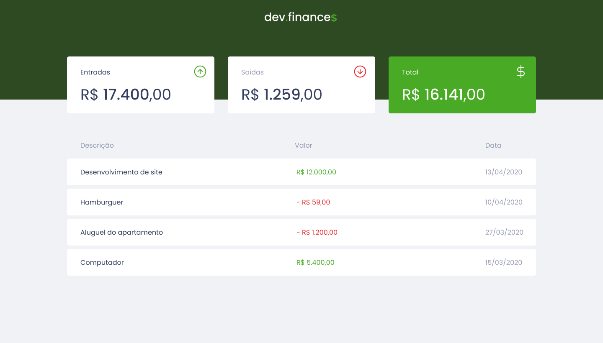

<h2 align="center">
	
</h2>

	
	

---

## 🚀 Sobre

Esse projeto foi desenvolvido com as seguintes tecnologias:

  [x] HTML
  [x] CSS
  [x] JavaScript

## 💻 Projeto

O dev.finances é uma aplicação de controle financeiro feito na maratona discover da [rocketseat](https://rocketseat.com.br/), onde é possível cadastrar e excluir transações e ver o saldo de entrada e saída.

---

by [Henrique Bortoletto](https://github.com.br) :wave: